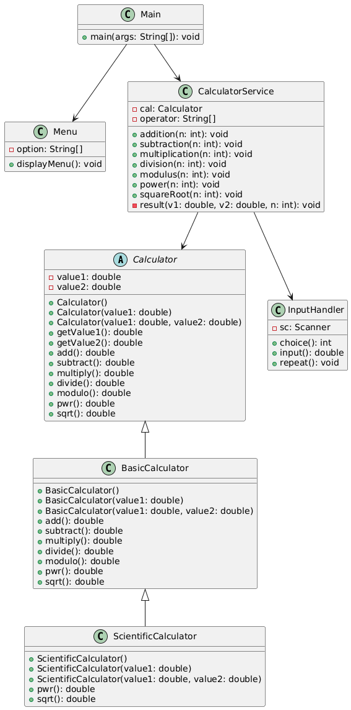

# 🧮 Advanced Console Calculator

A **Java console-based calculator** that supports both **basic** and **scientific operations**. This project demonstrates **object-oriented programming (OOP)** concepts such as **abstraction, inheritance, and polymorphism**, along with **robust input handling**.

---

## ⚡ Features

- **Basic Operations**
  - ➕ Addition
  - ➖ Subtraction
  - ✖️ Multiplication
  - ➗ Division
  - 🔢 Modulus

- **Scientific Operations**
  - 🔼 Power (`x^y`)
  - √ Square Root (`√x`)

- **Input Validation**
  - ✅ Prompts user until valid input is entered
  - 🔄 Prevents crashes due to invalid numbers

- **User-Friendly**
  - 🖥️ Menu-driven interface
  - 🔁 Option to perform multiple calculations in one session

- **Clean Output**
  - 🖨️ Displays results clearly in the console
  - ⚠️ Currently shows full decimal numbers (can be improved later)

---

## 🛠️ Technologies Used

- Java (OOP concepts)
- Console-based input/output
- Modular project structure with packages:
  - `calculator` → Calculator classes
  - `service` → Calculation logic
  - `ui` → User input & menu handling

---

## 📁 Project Structure
```
Advanced-Console-Calculator/
├─ Assets/
│ └─ uml.png
├─ calculator/
│ ├─ Calculator.java
│ ├─ BasicCalculator.java
│ └─ ScientificCalculator.java
├─ service/
│ └─ CalculatorService.java
├─ ui/
│ ├─ Menu.java
│ └─ InputHandler.java
├─ Main.java
├─ README.md
└─ .gitignore
```
---

## 💻 Console Output Example
```
===== ADVANCED CONSOLE CALCULATOR =====

Select Operation:
1 Addition
2 Subtraction
3 Multiplication
4 Division
5 Modulus
6 Power
7 Square Root

Enter your choice: 1
Enter number: 12
Enter number: 8

Result: 12.0 + 8.0 = 20.0

Do you want another calculation? (y/n): y

Select Operation:
1 Addition
2 Subtraction
3 Multiplication
4 Division
5 Modulus
6 Power
7 Square Root

Enter your choice: 6
Enter number: 2
Enter number: 3

Result: 2.0 ^ 3.0 = 8.0

Do you want another calculation? (y/n): n

Thank you for using Advanced Console Calculator. Goodbye!
```
---

## 📊 UML Diagram


> UML diagram showing the class structure and relationships of the calculator project.
 
---

## 👤 Author

**Salem Nur Abir**  
CSE Student at AIUB

---
